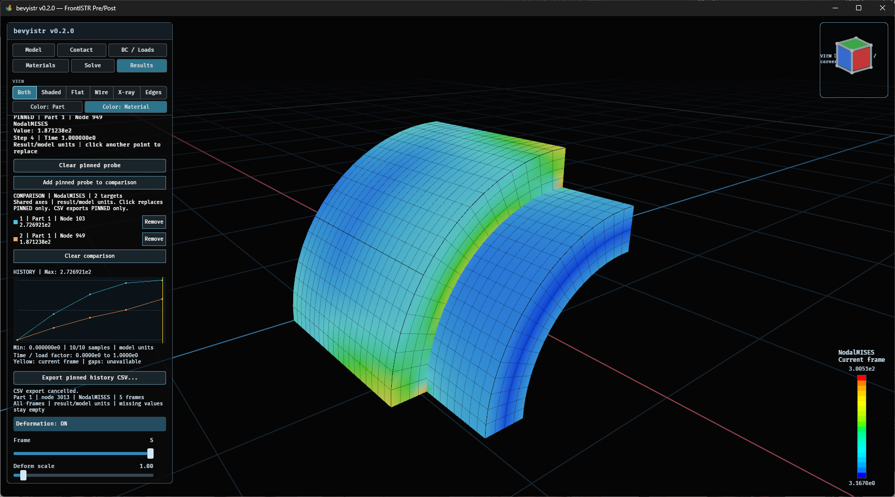

# マウスを合わせて値を確認する（ホバープローブ）

Resultsで再生を停止し、結果の表面にマウスを合わせると、現在のコンターフィールドの値、部品番号、要素ID、Step／Timeを表示します。クリックや選択操作は不要です。

0.3.0向け開発版では、`EIGENVALUE`を持つ結果はStep／Timeの代わりにMode／Eigenvalueを表示します。固定プローブも同様です。

- **節点フィールド**: ヒットした表示三角形の頂点のうち、ヒット位置に最も近い節点のIDと格納値を表示します。マーカーはその節点を示します。カーソル位置で補間した値ではありません。ベクトルは大きさ（Magnitude）、成分フィールドは選択した成分の値です。
- **要素フィールド**: ヒット面を持つ要素の格納値を表示します。節点への平均化はしません。マーカーはヒット位置を示します。
- 判定位置は変形ON/OFFと変形倍率に追従します。倍率を変えても表示する解析値は変わりません。
- 欠損・非有限値は`unavailable`と表示し、ゼロで補いません。単位は結果・モデルの単位系に従い、アプリでは推測しません。IDは読み込んだ結果モデルのIDです。
- 再生中、マウスボタンを押している間、UI上、他ページでは表示しません。停止後の最初のホバーで検索用データを作り、カーソル移動では再利用します。

現在は境界面の三角形を対象とする表面プローブです。線要素だけのモデルや内部要素の直接指定には未対応です。Wire／X-rayでも最前面の境界面を対象とし、奥の要素を透過選択する機能ではありません。

## 同じ節点・要素の値を追う（固定プローブ）

1. 再生を止め、表面をホバーして対象を確認します。
2. 表面をクリックすると、Resultsパネルの**PINNED**欄に部品番号・節点／要素ID・物理量・値・Step／Timeを固定表示します。
3. フレーム移動や再生を行うと、同じ対象の値が更新されます。マウスをモデルから離しても表示を保持します。
4. 別の表面位置をクリックすると対象を置き換えます。解除は**Clear pinned probe**です。

節点の固定対象はクリックした三角形の最寄り節点で、カーソル位置で補間した値ではありません。要素ではその要素の格納値を使用します。複数ピースで同じIDがあっても部品番号と組み合わせて区別し、別部品の値へ切り替えません。現在の固定対象はパネルのIDで確認します。ホバーのマーカーは固定位置を示すものではありません。

コンターの物理量を変更すると、固定対象でその物理量を確認できます。ただし節点から要素、または要素から節点へ対象を自動変換しません。対象に対応しない物理量、未出力・非有限値は`unavailable`と表示し、必要なら表面を再クリックして対象を選び直します。変形倍率は解析値に影響しません。

カメラのドラッグやUI操作は固定操作として扱いません。新しい結果・モデルの読み込み、Resultsから他ページへの移動では固定を解除します。固定は閲覧用で、解析設定やプリの選択を変更しません。

## 固定対象の時系列グラフ

固定すると、同じ欄の下に**HISTORY**グラフが表示されます。現在のコンター物理量について、読み込んだ全フレームの同じ対象の値を描きます。物理量や固定対象を変更するとグラフも切り替わります。

- **縦軸**：対象の値。上にMax、下にMinを示します。一定値は中央の水平線（1フレームなら点）として描き、Constantと明記します。ベクトルフィールドは大きさです。
- **横軸**：記録された時刻／荷重係数が有限で厳密に増加している場合は、その間隔で配置します。時刻が未記録・重複・逆行する場合はFrame番号に切り替え、理由を明記します。1フレームだけならFrame 1の点です。
- **固有値解析（開発版）**：`EIGENVALUE`を持つ系列は時刻で配置せず、読み込み順のMode/frame sequence（not time）になります。モード間を結ぶ線は時間的な変化や振動波形を示しません。
- **黄色の縦線・点**：現在表示しているフレームと、その値。コマ送りや再生に追従します。欠損フレームでは縦線だけを表示します。
- **線の途切れ**：未出力、非有限値、節点／要素の不一致などです。ゼロ埋めや欠損区間をまたいだ接続はしません。有効サンプル数も表示します。

グラフの値域は固定対象の全履歴から求めます。モデル全体のコンター色範囲や変形倍率とは独立しています。表示はモデルの単位系に従い、単位を推測・変換しません。グラフ自体は閲覧専用で、フレーム移動には既存のスライダーやコマ送りボタンを使います。グラフの拡大操作は未対応です。

## 複数の節点・要素を比較する（開発版・0.3.0向け）

この機能は公開済みv0.2.0には含まれません。

1. 停止中に表面をクリックし、**PINNED**の部品・IDを確認します。
2. **Add pinned probe to comparison**で比較対象に追加します。
3. 別の場所をクリックして同じボタンで追加します。最大4対象です。
4. **COMPARISON**の色・番号・部品・IDと、**HISTORY**の同じ色の曲線を見比べます。
5. フレームを移動すると一覧の値と黄色の縦線が追従します。

通常クリックはPINNEDだけを置き換え、登録済みの比較対象は変更しません。
**Clear pinned probe**でも比較は残ります。各行の**Remove**で個別解除、
**Clear comparison**で全解除します。残った対象の色・番号は変えません。
比較を全解除すると、PINNEDがあれば通常の単一履歴に戻ります。

表示例：Part 1のNode 103（水色）とNode 949（橙色）の5フレームを比較しています。
画面の版番号は開発時点の0.2.0ですが、この比較機能は公開済み0.2.0には含まれません。

比較中はHISTORYを1つの重ね描きグラフとして使い、全比較対象・全フレームの共通Min／Maxを縦軸にします。
黄色の目印は縦線のみです。欠損区間は線でつながず、一覧の値は`unavailable`になります。
同じ部品ローカルIDでも部品が異なれば別対象として扱います。

現在のコンター物理量を全対象で比較します。互換性がある別フィールドへ切り替えると一緒に更新します。
節点量と要素量、大きさとスカラーを混在させず、対応しないフィールドへの変更では理由を表示して比較を解除します。
全フレームのStep／Timeとフレーム数が一致しない部品は追加できません。補間・時刻の並べ替えはしません。
固有値解析ではTimeではなくモード番号・固有値を照合し、通常のステップ系列とは混在させません。
単位情報は推測しないため、読み込んだ結果が同じ単位系であることは利用者が確認してください。
新しい結果・モデルの読み込みやResultsから他ページへの移動でも比較を解除します。

**CSV保存は比較一覧ではなく現在のPINNEDだけ**が対象です。
比較全体の一括CSV保存は未対応です。必要な対象を順に固定して保存してください。

## 履歴をCSVで保存する（開発版・0.3.0向け）

この機能は公開済みv0.2.0には含まれません。

1. 表面をクリックし、**PINNED**の部品番号・節点／要素IDを確認します。
2. 保存したいコンター物理量を選び、**HISTORY**を確認します。
3. 履歴直下の**Export pinned history CSV...**を押して保存先を選びます。
4. **Saved:**に保存先と対象が表示されたら完了です。キャンセル・失敗も同じ欄に表示します。

固定対象がない場合や保存処理中はボタンが無効になります。拡張子は`.csv`です。
同名ファイルを置き換える場合は確認します。保存キャンセルは既存ファイルや解析設定を変更しません。
保存ダイアログと書き込みは別スレッドで処理し、クリック時点の対象・物理量・全フレームを保存します。
保存中にフレームや結果を切り替えても、保存対象は別データに切り替わりません。

CSVはUTF-8、カンマ区切り、CRLF改行です。文字列の引用符・カンマ・改行はエスケープします。
表計算ソフトではUTF-8のCSVとして読み込み、物理量名は文字列として扱ってください。
値は画面表示用に丸める前の格納精度で出力します。

| 列 | 内容 |
|---|---|
| `part`, `target_kind`, `target_id` | 画面と同じ1始まりの部品番号、`node`／`element`、部品ローカルID。部品番号とIDを組み合わせて対象を識別します。 |
| `field`, `quantity` | 選択した物理量名と、`magnitude`（ベクトルの大きさ）／`scalar_or_component`（スカラーまたは成分）／`unavailable`（フィールドなし）。 |
| `frame`, `step` | 読み込み順の1始まりFrame番号と、結果に記録されたStep番号。並べ替えません。 |
| `time_or_load_factor`, `time_status` | 通常のステップでは格納されたTime／荷重係数。有限なら`recorded_or_default`、非有限なら空欄と`unavailable`。未記録時刻の既定値0と実時刻0は区別できません。固有値のあるモードでは空欄と`not_applicable_for_mode`です。秒や固有振動数とは断定しません。 |
| `value`, `value_status` | 解析値と`available`。未出力・非有限値・節点／要素種別の不一致等は空欄と`unavailable`。ゼロ埋めしません。 |
| `units` | `result/model units`。単位の推測・換算はしません。 |
| `frame_kind` | `EIGENVALUE`があれば`mode`、なければ`step`。 |
| `mode`, `eigenvalue` | モードの元の出力番号とファイル内の固有値。通常のステップでは両方空欄。周波数へ換算しません。 |

モード対応の3列は既存の12列の後ろに追加しています。CSVを処理するスクリプトでは列名を使用してください。

出力値はグラフと同じ抽出処理を使います。変形倍率・コンターの色範囲を変えても保存値は変わりません。
全フレームが欠損の場合も状態を記録でき、現在表示している1フレームだけに絞りません。
